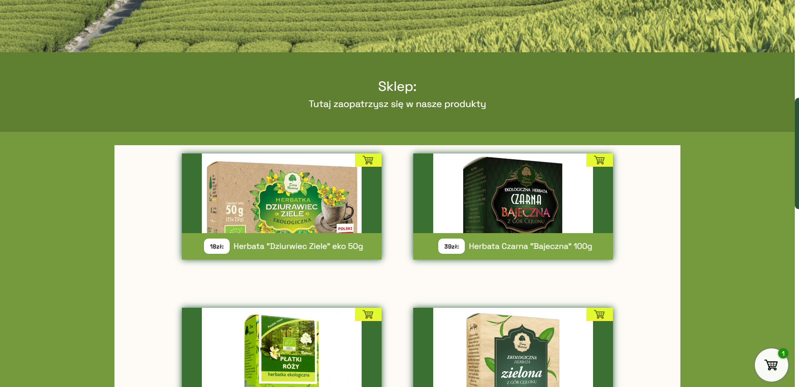

<h2 align="center"> Superherbapl - Przykładowy sklep z herbatą </h1>
<h3 align="center">O Projekcie:</h3>
<h3 align="center">Projekt został zrobony tak o dla siebie.Do stworzenia go  użyłem vanilla js, css, i oczywiście html</h3>
 <h2 align="center">Edycja i używanie go:</h2>
<h2 align="center"> Ten projek możesz dowolnie edytować/przerabiać pod warunkiem że nie użyjesz go w celach komercyjnych </h2> 
<h2 align="center">Galeria:</h2>
   
  <
  
  
  

